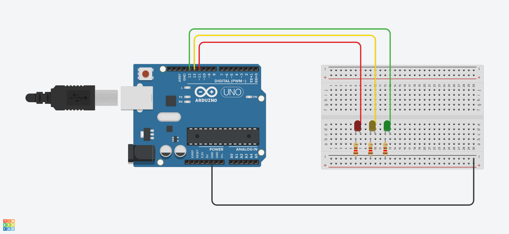

# 01 - Semáforo Simple

Construir un semáforo con 3 led (Rojo, Amarillo, Verde) y que se prenda y apague en un determinado tiempo.

### Ejemplo:

### Diagrama:

[Descargar .drawio](./assets/diagram.drawio)

# Desarrollar

Para realizar el proyecto se hace uso de la plataforma [tinkercad.com](https://www.tinkercad.com/), por tanto debe primero tener una cuenta en la plataforma.

### Componentes a utilizar:
- 1 Placa arduino UNO
- 1 Protoboard
- 1 LED Rojo
- 1 LED Amarillo
- 1 LED Verde
- 3 resistencias de 120 Ω
- Jumpers (Cables)

### Pasos:
1. clonar el repositorio actual:
    > git clone https://github.com/okarook/ucc-electiva-iv.git

2. Ir al directorio del proyecto:
    > cd ucc-electiva-iv/01-semaforo-simple/

3. Crear el siguiente montaje en la plataforma [tinkercad.com](https://www.tinkercad.com/).

4. Abrir el archivo `src/main.ino` en su editor preferido y copiar el código en la plataforma [tinkercad.com](https://www.tinkercad.com/)

5. Por ultimo dar clic en el botón iniciar ejecución

## Licencia
[MIT License](./../LICENSE)
