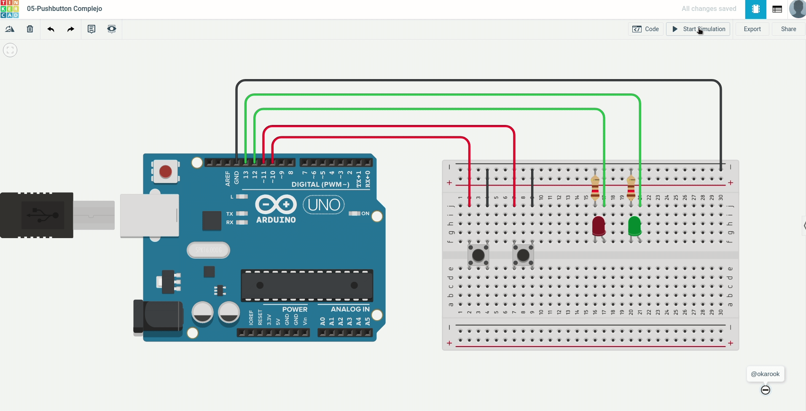

# 05 - Pushbutton Complejo

Construir un interruptor con 2 LEDs y dos pulsador, el comportamiento debe ser el siguiente:
- Cuando pulse el botón uno: Se deben manipular los dos LEDs, si están prendidos se debe apagar y de forma viceversa.
- Cuando pulse el botón dos: Se debe manipular un LED, si esta prendido se debe apagar y de forma viceversa.

### Ejemplo:

### Diagrama:

[Descargar .drawio](./assets/diagram.drawio)

# Desarrollar

Para realizar el proyecto se hace uso de la plataforma [tinkercad.com](https://www.tinkercad.com/), por tanto debe primero tener una cuenta en la plataforma y crear un proyecto nuevo.

### Componentes a utilizar:
- 1 Placa arduino UNO
- 1 Protoboard
- 2 LEDs
- 2 Pushbuttons
- 2 resistencias de 120 Ω
- Jumpers (Cables)

### Pasos:
1. clonar el repositorio actual:
  > git clone https://github.com/okarook/ucc-electiva-iv.git

2. Ir al directorio del proyecto:
  > cd ucc-electiva-iv/05-pushbutton-complejo/

3. Crear el siguiente montaje en la plataforma [tinkercad.com](https://www.tinkercad.com/).

4. Abrir el archivo `src/main.ino` en su editor preferido y copiar el código en la plataforma [tinkercad.com](https://www.tinkercad.com/)

5. Por último dar clic en el botón iniciar ejecución

6. Puede ver el proyecto [aquí](https://www.tinkercad.com/things/amqrceyTn0q)

## Licencia
[MIT License](./../LICENSE)
