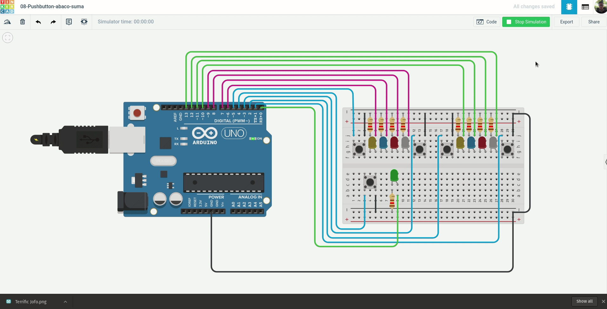
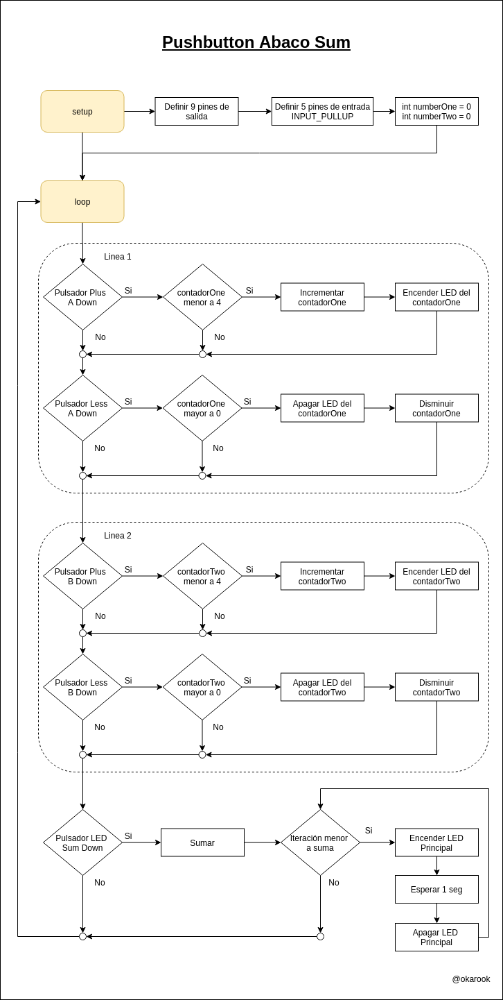
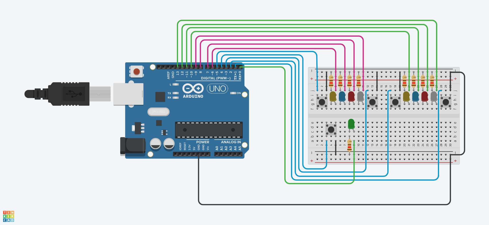

# 08 - Pushbutton ábaco suma

El circuito contiene 9 LEDs que representan 2 lineas de ábaco de 4 LEDs cada una y 1 LED de resultado el cual debe informar del resultado de la suma mediante la intermitencia, es decir cada que se oprima el pulsador de resultado el led debe emitir una cantidad de parpadeos equivalentes al resultado.

Para mover las dos lineas del ábaco, debe haber 2 pulsadores por linea para sumar y restar, es decir ir encendiendo LEDs para la suma y apagando LEDs para el pulso de resta.

### Ejemplo:

### Diagrama:

[Descargar .drawio](./assets/diagram.drawio)

# Desarrollar

Para realizar el proyecto se hace uso de la plataforma [tinkercad.com](https://www.tinkercad.com/), por tanto debe primero tener una cuenta en la plataforma y crear un proyecto nuevo.

### Componentes a utilizar:
- 1 Placa arduino UNO
- 1 Protoboard
- 9 LEDs
- 5 Pushbuttons
- 9 resistencias de 120 Ω
- Jumpers (Cables)

### Pasos:
1. clonar el repositorio actual:
  > git clone https://github.com/okarook/ucc-electiva-iv.git

2. Ir al directorio del proyecto:
  > cd ucc-electiva-iv/08-Pushbutton-abaco-sum/

3. Crear el siguiente montaje en la plataforma [tinkercad.com](https://www.tinkercad.com/).

4. Abrir el archivo `src/main.ino` en su editor preferido y copiar el código en la plataforma [tinkercad.com](https://www.tinkercad.com/)

5. Por ultimo dar clic en el botón iniciar ejecución

6. Puede ver el proyecto [aquí](https://www.tinkercad.com/things/52DPUEdNpOE)

## Licencia
[MIT License](./../LICENSE)
