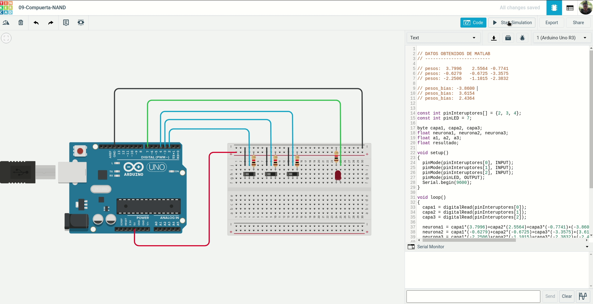
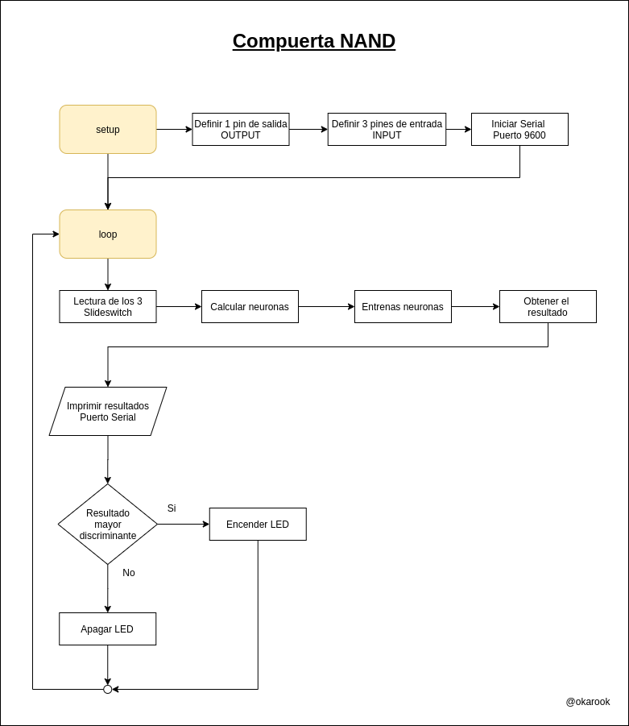
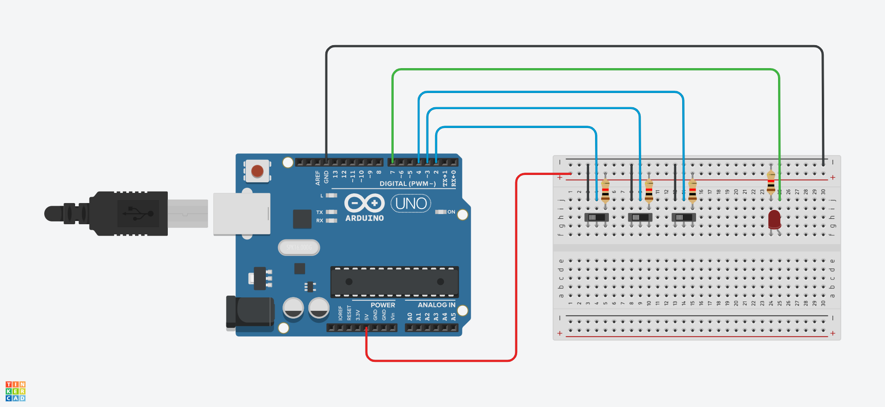

# 09 - Compuerta NAND

Desarrollar la red neuronal para la compuerta NAND de 3 entradas en la plataforma MATHLAB y realizar la representación en arduino.

### Ejemplo:

### Diagrama:

[Descargar .drawio](./assets/diagram.drawio)

# Desarrollar

Para realizar el proyecto se hace uso de la plataforma [tinkercad.com](https://www.tinkercad.com/) y [mathlab](https://la.mathworks.com/products/matlab-online.html), por tanto debe primero tener una cuenta en cada plataforma y crear un proyecto nuevo.

### Componentes a utilizar:
- 1 Placa arduino UNO
- 1 Protoboard
- 1 LED
- 3 Slideswitch
- 4 resistencias de 120 Ω
- Jumpers (Cables)

### Pasos:
1. clonar el repositorio actual:
  > git clone https://github.com/okarook/ucc-electiva-iv.git

2. Ir al directorio del proyecto:
  > cd ucc-electiva-iv/09-compuerta-NAND/

3. Abrir el archivo `src/mathlab.m` en su editor preferido y copiar el código en la plataforma [mathlab](https://la.mathworks.com/products/matlab-online.html)

4. Ejecutar el programa en [mathlab](https://la.mathworks.com/products/matlab-online.html)

5. Crear el siguiente montaje en la plataforma [tinkercad.com](https://www.tinkercad.com/).

6. Abrir el archivo `src/main.ino` en su editor preferido y copiar el código en la plataforma [tinkercad.com](https://www.tinkercad.com/)

7. Por ultimo dar clic en el botón iniciar ejecución

8. Puede ver el proyecto [aquí](https://www.tinkercad.com/things/fUNRizsKK5U)

## Licencia
[MIT License](./../LICENSE)
