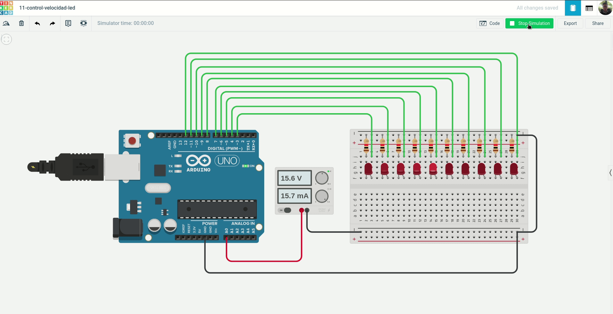
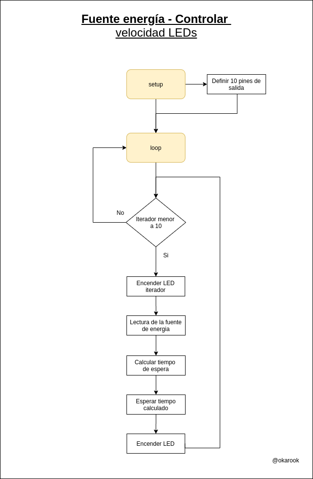
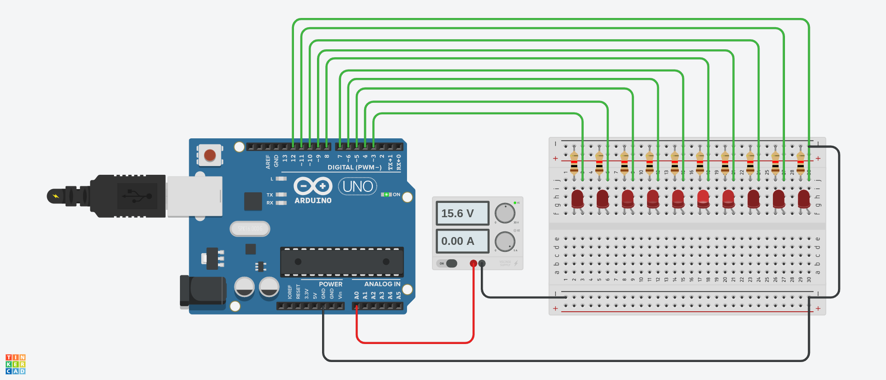

# 11 Fuente de energía - Controlar velocidad LEDs

Hacer uso de una fuente de poder y hacer que un solo led se  encienda y se mueva encendido por cada uno de los LEDs que se encuentran apagados (el efecto es que la luz va pasando de un led a otro, por donde ya pasó se apague, ejemplo de derecha a izquiera y cuando llegue a la izquierda vuelva a iniciar en el sentido de derecha a izquierda), de acuerdo a la velocidad que se le configure en la fuente de poder, la cual consiste en: menor voltaje menor velocidad y a mayor voltaje mayor velocidad.

### Ejemplo:

### Diagrama:

[Descargar .drawio](./assets/diagram.drawio)

# Desarrollar

Para realizar el proyecto se hace uso de la plataforma [tinkercad.com](https://www.tinkercad.com/), por tanto debe primero tener una cuenta en la plataforma y crear un proyecto nuevo.

### Componentes a utilizar:
- 1 Placa arduino UNO
- 1 Protoboard
- 10 LEDs
- 1 fuente de energía
- 10 resistencias de 120 Ω
- Jumpers (Cables)

### Pasos:
1. clonar el repositorio actual:
  > git clone https://github.com/okarook/ucc-electiva-iv.git

2. Ir al directorio del proyecto:
  > cd ucc-electiva-iv/10-fuente-energia-sensor/

3. Crear el siguiente montaje en la plataforma [tinkercad.com](https://www.tinkercad.com/).

4. Abrir el archivo `src/main.ino` en su editor preferido y copiar el código en la plataforma [tinkercad.com](https://www.tinkercad.com/)

5. Por último dar clic en el botón iniciar ejecución

6. Puede ver el proyecto [aquí](https://www.tinkercad.com/things/aUlzfIJ1gLD)

## Licencia
[MIT License](./../LICENSE)
