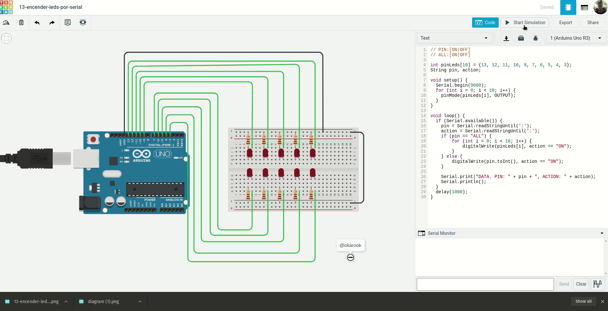
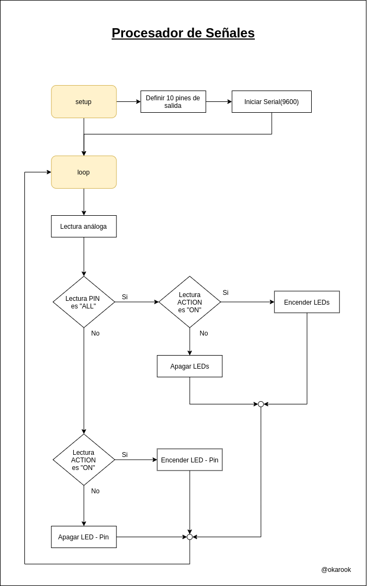
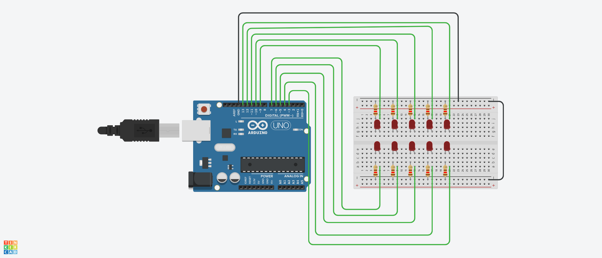

# 13 - Procesador de Señales

Procesar las señales enviadas por el puerto serial, se cuenta con 10 leds que representan el panel de accion para las señales enviadas, estas señales corresponden a 3 comandos:
- Encendido Total (ALL:ON)
- Apagado Total (ALL:OFF)
- Encendido o Apagado por Led (PIN:[OFF|ON])

### Ejemplo:

### Diagrama:

[Descargar .drawio](./assets/diagram.drawio)

# Desarrollar

Para realizar el proyecto se hace uso de la plataforma [tinkercad.com](https://www.tinkercad.com/), por tanto debe primero tener una cuenta en la plataforma y crear un proyecto nuevo.

### Componentes a utilizar:
- 1 Placa arduino UNO
- 1 Protoboard
- 10 LEDs
- 10 resistencias de 120 Ω
- Jumpers (Cables)

### Pasos:
1. clonar el repositorio actual:
  > git clone https://github.com/okarook/ucc-electiva-iv.git

2. Ir al directorio del proyecto:
  > cd ucc-electiva-iv/13-encender-leds-por-serial/

3. Crear el siguiente montaje en la plataforma [tinkercad.com](https://www.tinkercad.com/).

4. Abrir el archivo `src/main.ino` en su editor preferido y copiar el código en la plataforma [tinkercad.com](https://www.tinkercad.com/)

5. Por ultimo dar clic en el botón iniciar ejecución

6. Puede ver el proyecto [aquí](https://www.tinkercad.com/things/dCspjOYz3yj)

## Licencia
[MIT License](./../LICENSE)
